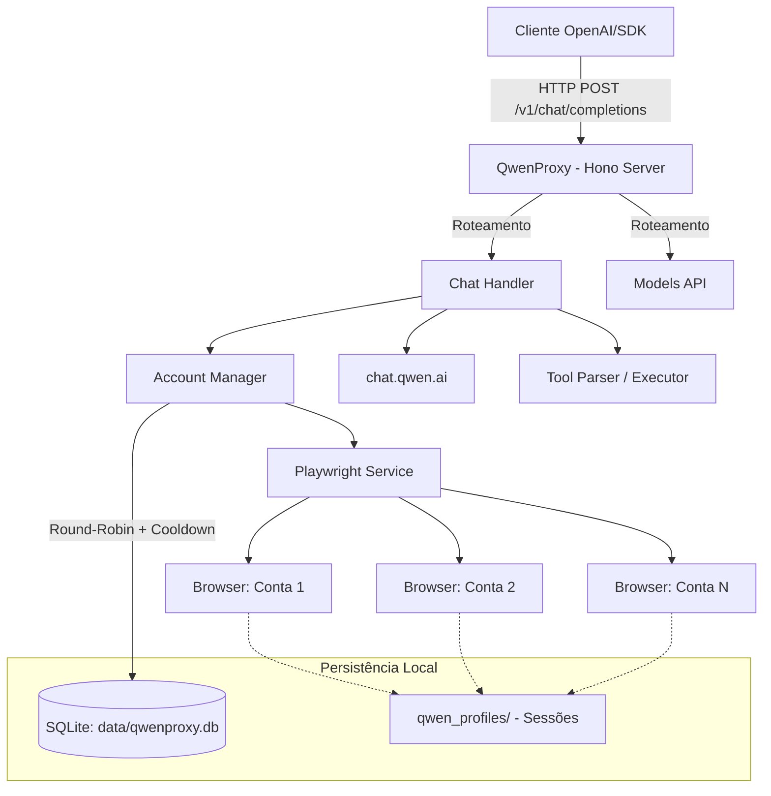

# Arquitetura do QwenProxy

Este documento descreve a arquitetura do sistema QwenProxy, uma API proxy local compatível com OpenAI que roteia requisições para o Qwen (chat.qwen.ai) via automação de navegador com Playwright.

## Diagrama de Arquitetura

## Fluxo Principal

1. **Requisição do Cliente**: O Cliente envia uma requisição compatível com OpenAI (ex: `/v1/chat/completions`) para o proxy.
2. **Recebimento e Roteamento**: O Chat Handler recebe a requisição e consulta o Account Manager para obter uma conta válida.
3. **Seleção de Conta**: O Account Manager seleciona uma conta disponível no banco de dados SQLite, utilizando um algoritmo de rotação *round-robin* e respeitando os períodos de *cooldown* (evitando contas com rate limit ou em erro).
4. **Automação do Navegador**: O Playwright Service utiliza o perfil persistido da conta selecionada (armazenado em `qwen_profiles/`) para injetar a requisição no navegador e interagir de forma automatizada com o `chat.qwen.ai`.
5. **Processamento e Resposta**: A resposta é processada em tempo real (streaming). Se houver chamadas de ferramentas, elas passam pelo Tool Parser/Executor antes de serem retornadas ao cliente.

## Componentes Principais

- **Hono Server**: Servidor web leve que expõe a API compatível com OpenAI.
- **Chat Handler**: Orquestra o processamento da requisição, formatação do prompt e gerenciamento do stream de resposta.
- **Account Manager**: Gerencia o estado das contas, rotação e políticas de cooldown.
- **Playwright Service**: Responsável pela automação do navegador e manutenção das sessões de usuário.
- **SQLite & Perfis Locais**: Garantem a persistência dos dados das contas e dos estados de sessão dos navegadores entre reinicializações.